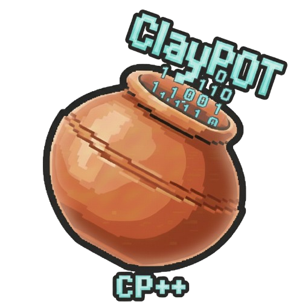

# 🏺 ClayPOT: RPG Maker Game Engine Prototype
> A custom-built C++ game engine prototype designed for modular RPG development.

## 🌟 Overview
ClayPOT is a lightweight game engine prototype developed to explore the fundamentals of game architecture, rendering pipelines, and RPG mechanics. It serves as a foundation for building grid-based role-playing games.

## 🛠 Features
* **Rendering Engine:** High-performance 2D sprite and tilemap rendering using SFML.
* **Entity System:** Basic framework for handling player movement and world interactions.
* **Resource Management:** Automated loading for textures, fonts, and game data.
* **Modular Architecture:** Separation of core engine logic (`src_code`) and build assets.

## 🚀 Getting Started
To test the current prototype without compiling the code yourself:

1.  Open the folder `Combined_Project/ClayPOT_exe`.
2.  Download the entire folder (ensure all `.dll` files stay with the `.exe`).
3.  Launch `ClayPOT.exe`.

## 💻 Tech Stack
* **Language:** C++17
* **Graphics:** [SFML](https://www.sfml-dev.org/) (Simple and Fast Multimedia Library)
* **IDE:** Visual Studio 2022

## 📂 Repository Structure
* **`src_code/`**: The core engine logic, headers, and source files.
* **`ClayPOT_exe/`**: Ready-to-run Windows executable and required dependencies.
